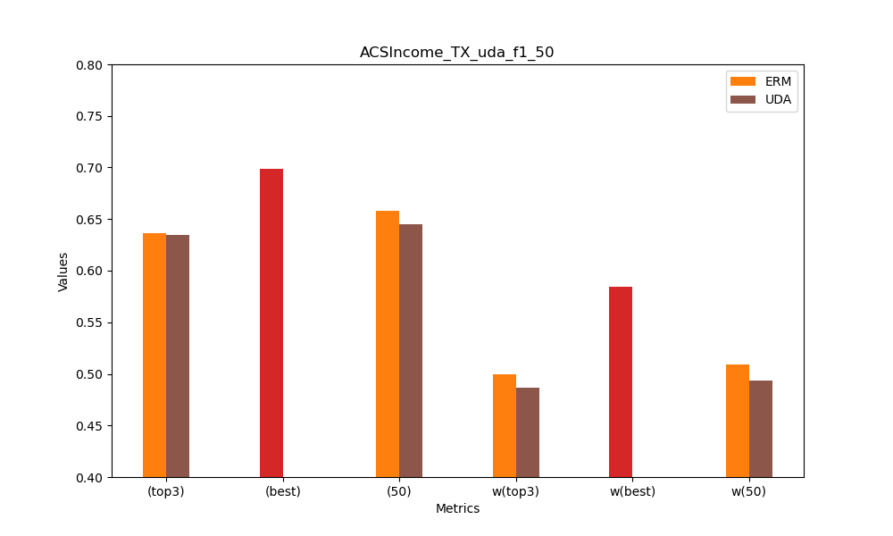
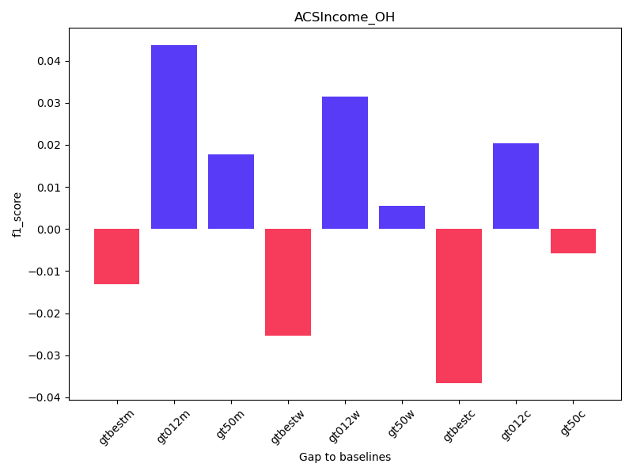

# Settings

3 * 800 vs 49 * 50
由于表现不稳定，进行20次重复实验取平均

Linear model

- top3是单独计算距离，排序后将前三个组合
- best是C10 3遍历出来的最优组合
- 50是49个环境每个50个样本
---
ACSIncome_OH

ACSIncome_TX

ACSEmployment_NY

ACSPublicCoverage_WA

## 初步结论： best > 49 * 50 > 012
- 通过某种距离metric，C10 3 遍历出最近的组合
（结果不稳定，取组合距离最小的三组的最优表现）
- 左边三个是mmd距离选出的组合表现，中间三个是wasserstein距离，右边三个是cosine similarity
- 计算目标组合和对应的baseline之间的差值
  
ACSIncome_OH

ACSIncome_TX

ACSEmployment_NY

ACSPublicCoverage_WA

