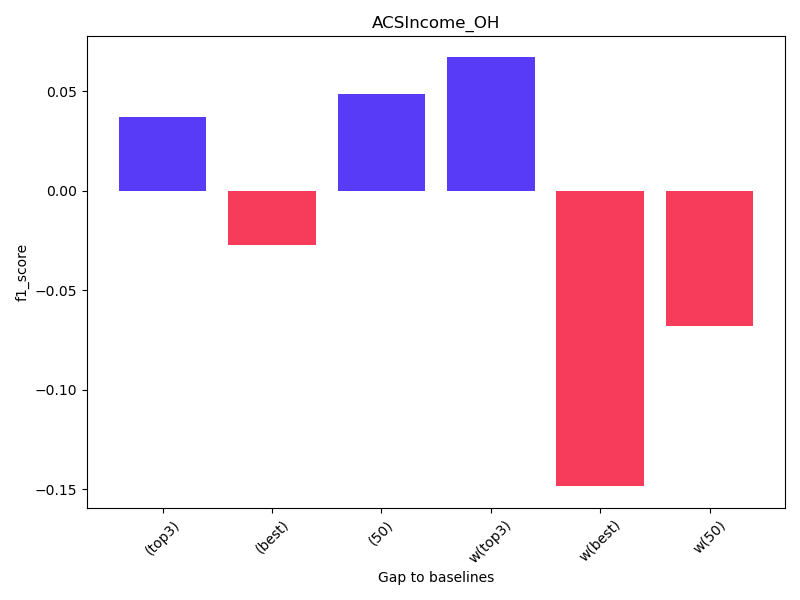
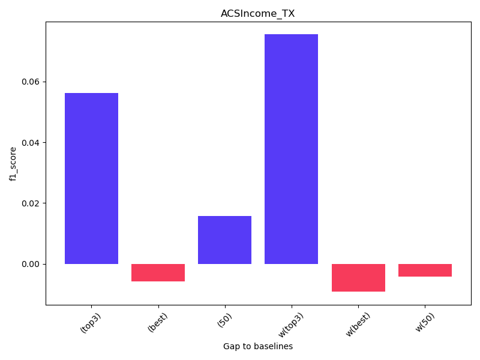
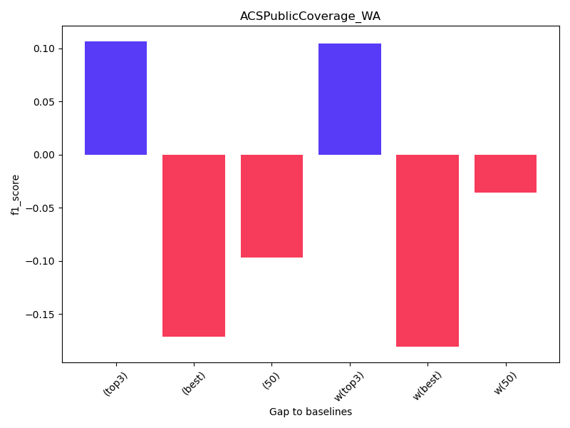
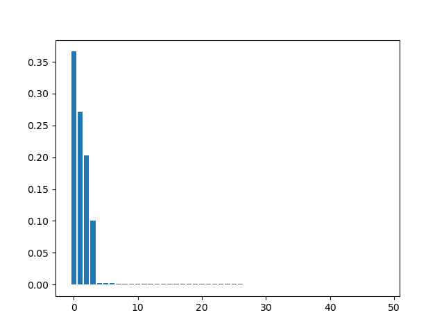
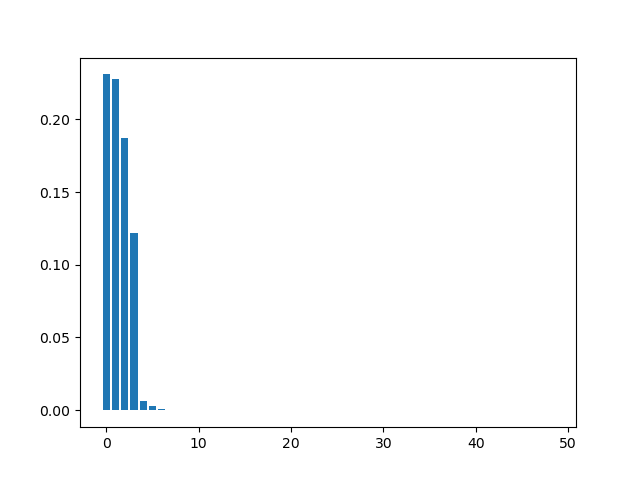
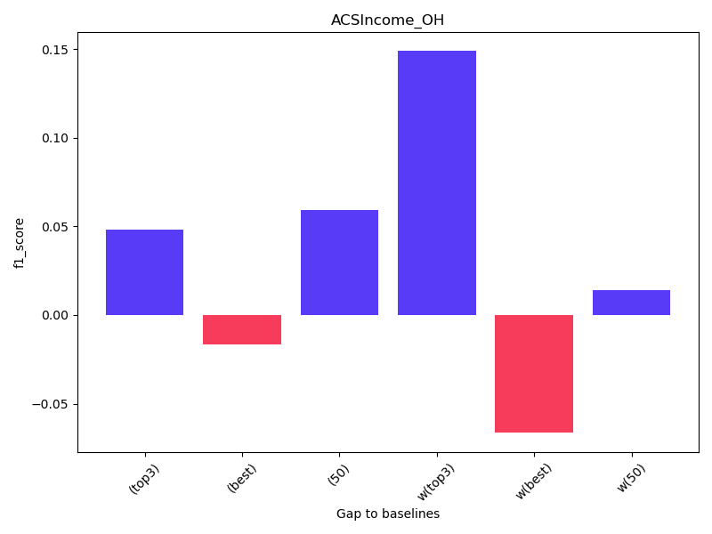
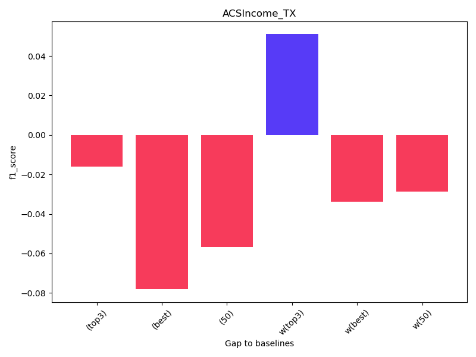
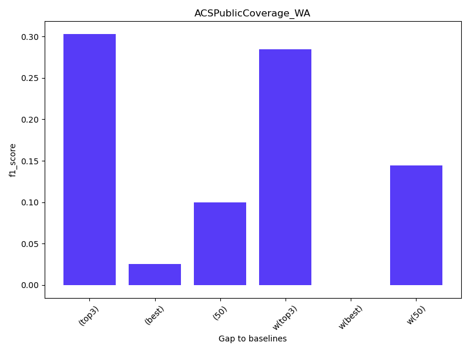

## common setting
- distance metric: MMD
- n_train: 800
- 图示的是我们的方法和其他方法之间的差值
## 遍历
50选3，遍历算组合距离，取最近的进行测试

ACSIncome_OH

ACSIncome_TX

ACSPublicCoverage_WA

## 优化
- 每个环境一个weight，加权中心点
- 线性模型 + l1 正则化
- 排序后的weight大致效果如下

选weight最大的三个环境测试
(重复三次取最好)

ACSIncome_OH

ACSIncome_TX

ACSPublicCoverage_WA

