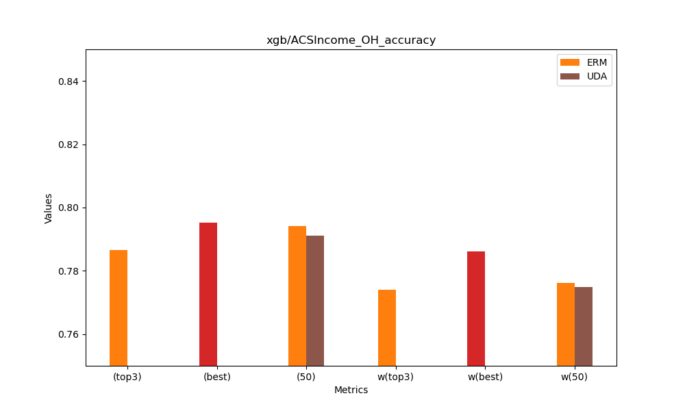
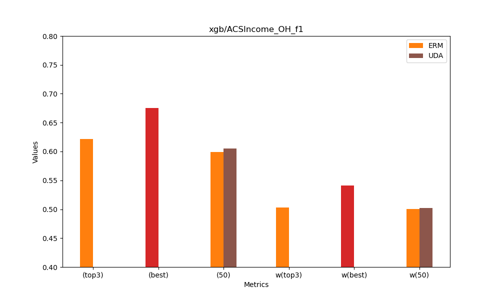
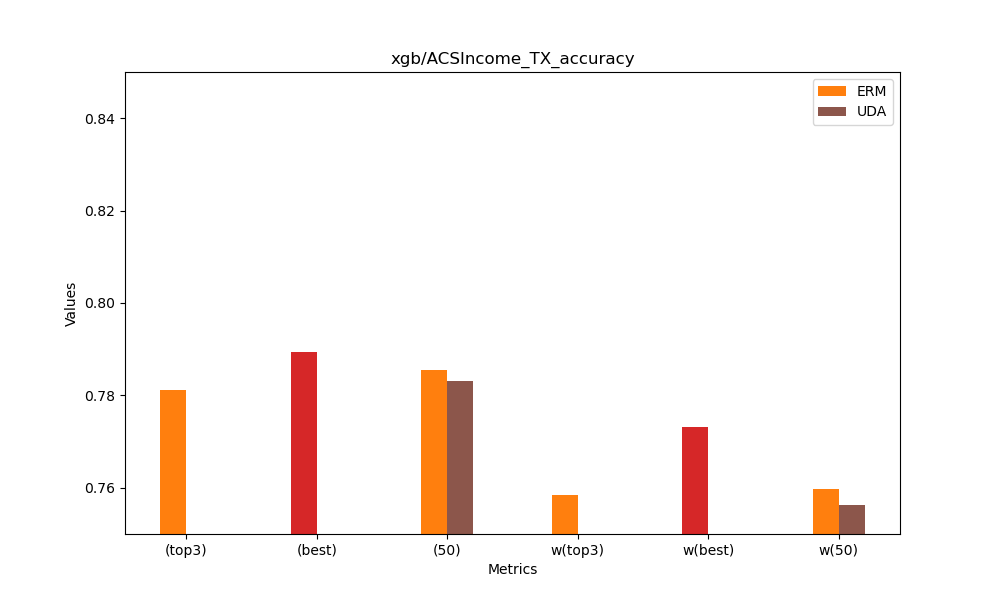
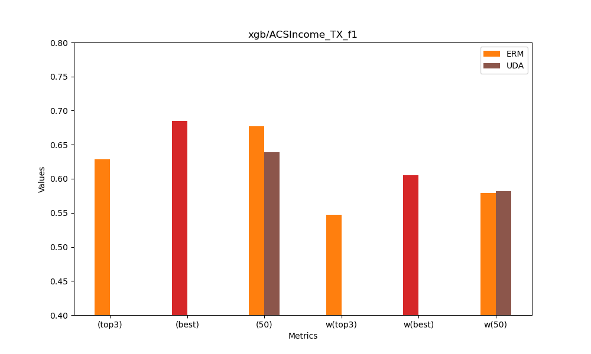
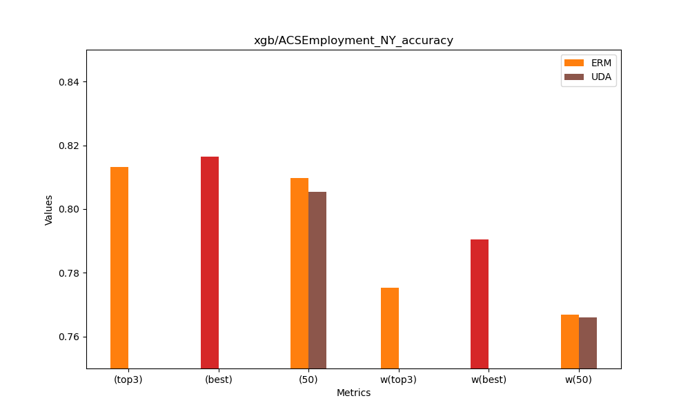
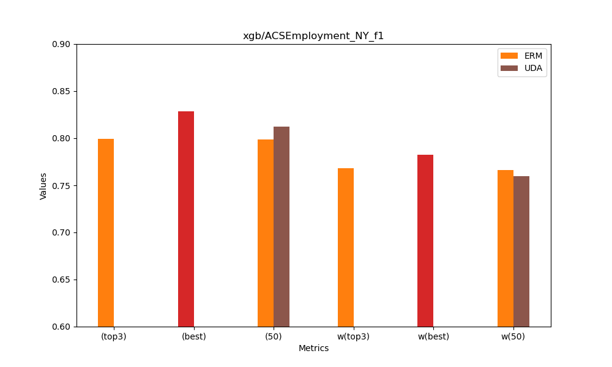
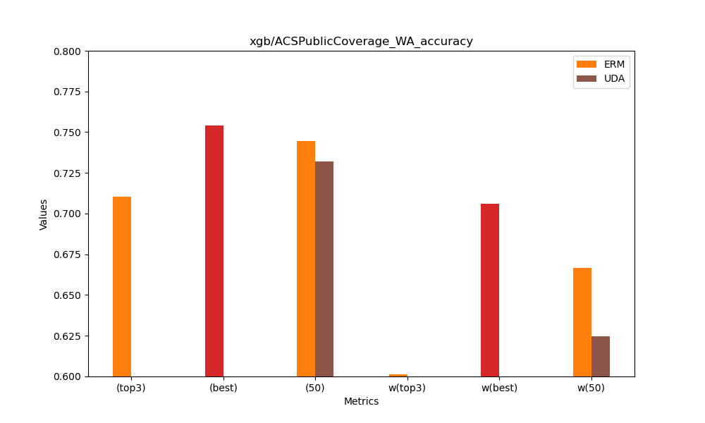
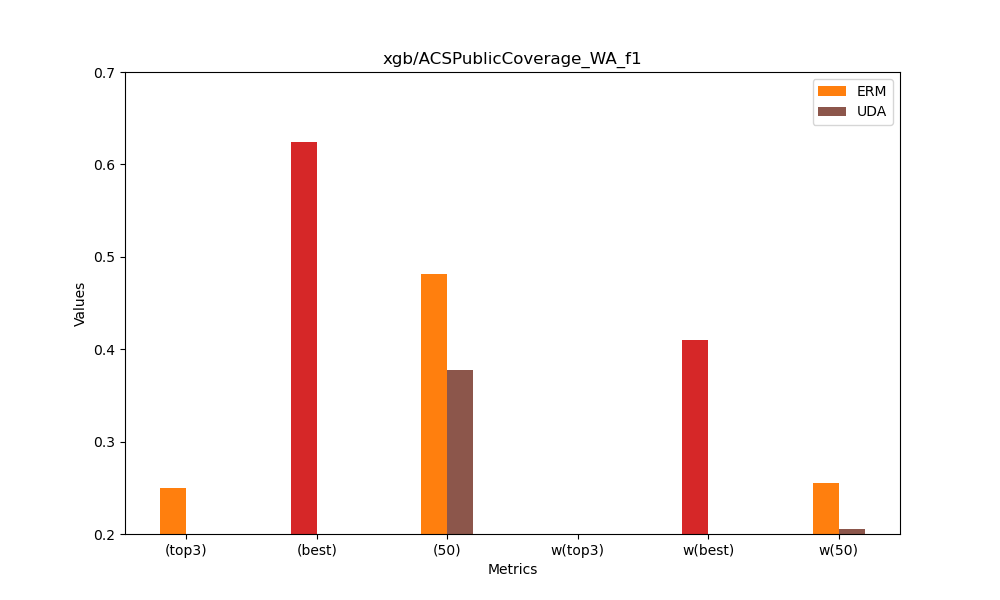

# Settings

3 * 800 vs 49 * 50
由于表现不稳定，进行20次重复实验取平均

XGBoost model

---
ACSIncome_OH

ACSIncome_TX

ACSEmployment_NY

ACSPublicCoverage_WA

### 初步结论：Accuracy平均表现上的gap几乎消失，worst group表现和f1_score上还存在优势